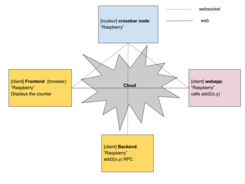
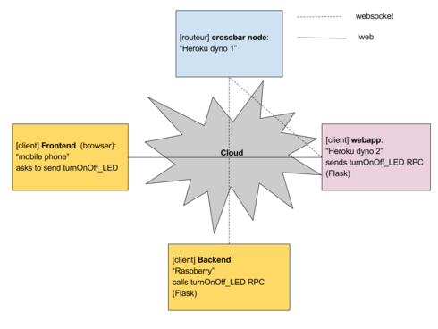

# Pi-crossbar

Flask Web application with Autobahn WAMP code using Crochet.
This application drives a LED via a raspberry pi.
The user is able to launch it from any platform (mobile device, computer, etc).

### Step 1:
release: https://github.com/HBevilacqua/Pi-crossbar/releases/tag/v20161014pm
- cloud = local network
- all nodes are hosted on the Raspeberry Pi itself
- the web application uses crochet
- the backend implements a remote procedure, add2(x, y)
- the web app can call this procedure because it is connected to the same router and realm.

#### Sources:
backend.py/frontend.py forked from https://github.com/HBevilacqua/crossbar_template

webapp.py forked from https://github.com/crossbario/autobahn-python/blob/224370cd9dda312fc0583b61ed416b3f4d0e00d0/examples/twisted/wamp/app/crochet/example1/server.py

templates/home.html forked from https://github.com/crossbario/autobahn-python/blob/224370cd9dda312fc0583b61ed416b3f4d0e00d0/examples/twisted/wamp/app/crochet/example1/client.html

### Step 2:
release: https://github.com/HBevilacqua/Pi-crossbar/releases/tag/v20101020step2
- cloud = local network
- add the remote procedure to blink the raspberry pi LED

### Step 3:
release: https://github.com/HBevilacqua/Pi-crossbar/releases/tag/v20161020step3
- cloud = local network
- the crossbar router is no longer hosted by the raspberry pi but by another node (for example my computer)
- you have to set the CROSSBAR_ROUTER_ADDRESS environment variable  with the new crossbar ip address 
before launching the backend.py and the webapp.py

### Step 4:
- cloud = internet
- The crossbar router is deployed through Heroku
fork from: https://github.com/AndreMiras/crossbar-hello-python-to-heroku.git
- The flask application (frontend) runs also on Heroku
fork from: https://github.com/AndreMiras/flask-autobahn-to-heroku.git
- The backend runs on the raspberry pi to drive the LED
- the web browser runs on my mobile phone

