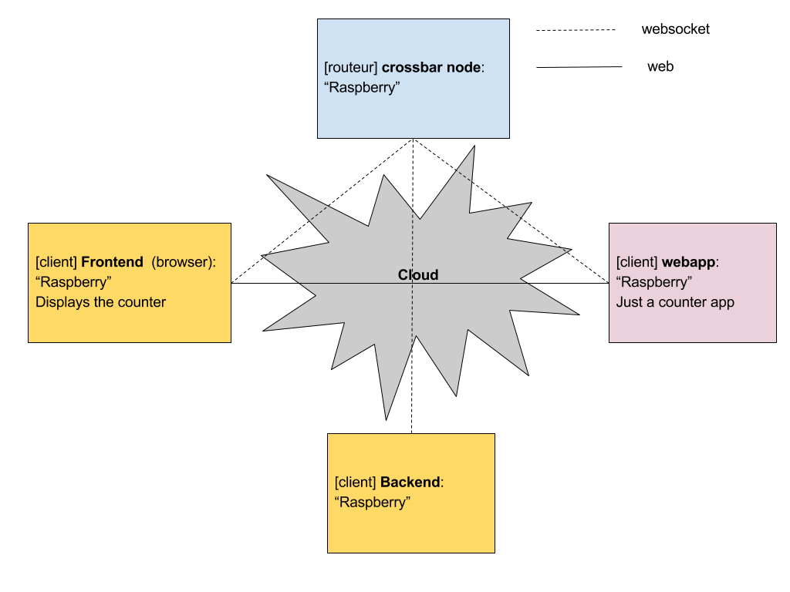

# Pi-crossbar

Flask Web application with Autobahn WAMP code using Crochet.

backend.py/frontend.py forked from https://github.com/HBevilacqua/crossbar_template

webapp.py forked from https://github.com/crossbario/autobahn-python/blob/224370cd9dda312fc0583b61ed416b3f4d0e00d0/examples/twisted/wamp/app/crochet/example1/server.py

templates/home.html forked from https://github.com/crossbario/autobahn-python/blob/224370cd9dda312fc0583b61ed416b3f4d0e00d0/examples/twisted/wamp/app/crochet/example1/client.html

Step 1 (current):

